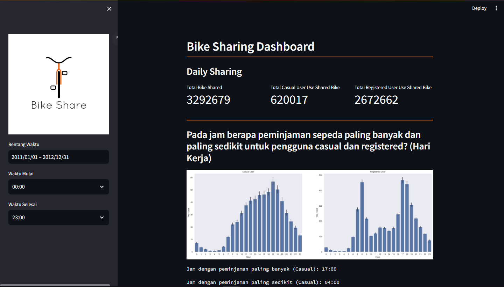

# Belajar Analisis Data dengan Python

## Preview


## Setup environment
```
conda create --name main-ds python=3.9
conda activate main-ds
pip install -r requirements.txt
```

## Run steamlit app
```
cd dashboard
streamlit run dashboard.py
```

